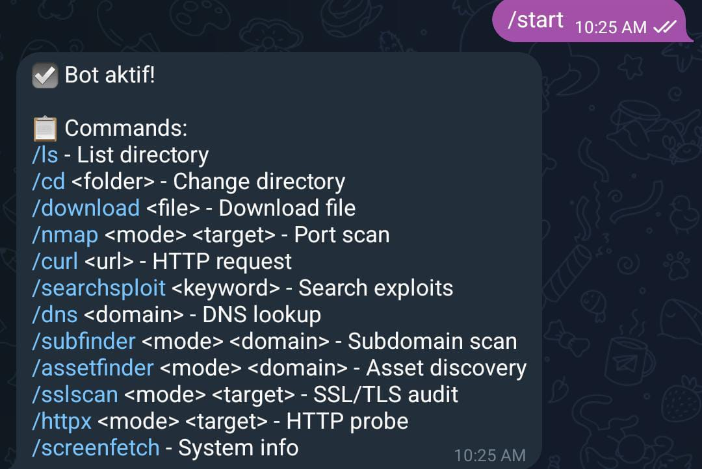
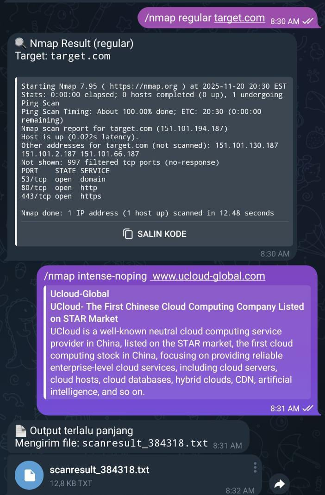

# GitKuroKali — Telegram Remote Pentest Utility

GitKuroKali adalah bot Telegram berbasis Python untuk menjalankan command pentesting dan utilitas sistem secara remote melalui Telegram.  
Direkomendasikan untuk dijalankan di **Kali Linux** (atau distro Linux lain yang mendukung security tools).

---

## ⚙️ Fitur Utama
- Navigasi filesystem (`/ls`, `/cd`, `/download`)
- Port scanning menggunakan Nmap
- HTTP request dengan CURL
- Pencarian exploit menggunakan SearchSploit
- DNS resolver
- Subdomain enumeration (Subfinder / Assetfinder)
- SSL/TLS scanning (sslscan)
- HTTP probing (httpx)
- System information (`screenfetch`)

---

## 📦 Installation

### Clone repository & install dependencies
```bash
git clone <repo-url>
cd <folder>
pip install -r requirements.txt
````

### Python Requirements

```
python-telegram-bot==21.3
```

### Install supporting tools (recommended: Kali Linux)

```bash
sudo apt update && sudo apt install curl nmap dnsutils screenfetch sslscan exploitdb
```

ProjectDiscovery tools:

```bash
go install -v github.com/projectdiscovery/httpx/cmd/httpx@latest
go install -v github.com/projectdiscovery/subfinder/v2/cmd/subfinder@latest
```

Assetfinder:

```bash
go install github.com/tomnomnom/assetfinder@latest
```

Tambahkan PATH:

```bash
export PATH=$PATH:$(go env GOPATH)/bin
```

---

## 🔐 Konfigurasi Bot Telegram

Buat bot melalui **BotFather**

```
/newbot
```

Edit konfigurasi pada script:

```python
BOT_TOKEN = "TOKEN DARI BOTFATHER"
ALLOWED_CHAT = [123456789]  # chat id yang diperbolehkan
```

### Cara mendapatkan Chat ID Telegram

1. Buka Telegram
2. Cari bot **@userinfobot**
3. Jalankan `/start`
4. Akan muncul informasi `id: 123456789`
5. Masukkan ID tersebut ke dalam `ALLOWED_CHAT`

---

## ▶️ Menjalankan Script

```bash
python GitKuroKali_v1.py
```

---

## 📌 Command Usage

| Command                        | Fungsi             |
| ------------------------------ | ------------------ |
| `/start`                       | Informasi bot      |
| `/ls`                          | List directory     |
| `/cd <folder>`                 | Pindah directory   |
| `/download <file>`             | Download file      |
| `/nmap <mode> <target>`        | Port scanning      |
| `/curl <url>`                  | HTTP request       |
| `/searchsploit <keyword>`      | Cari exploit       |
| `/dns <domain>`                | DNS lookup         |
| `/subfinder <mode> <domain>`   | Subdomain scan     |
| `/assetfinder <mode> <domain>` | Asset discovery    |
| `/sslscan <mode> <target>`     | SSL security check |
| `/httpx <mode> <target>`       | HTTP probing       |
| `/screenfetch`                 | System info        |

---

## 📷 Screenshot Setup




---

## ⚠️ Disclaimer

Gunakan script ini **hanya untuk tujuan legal** dan pada environment yang sepenuhnya Anda miliki.
Segala bentuk penyalahgunaan merupakan tanggung jawab masing-masing pengguna.

```

---
